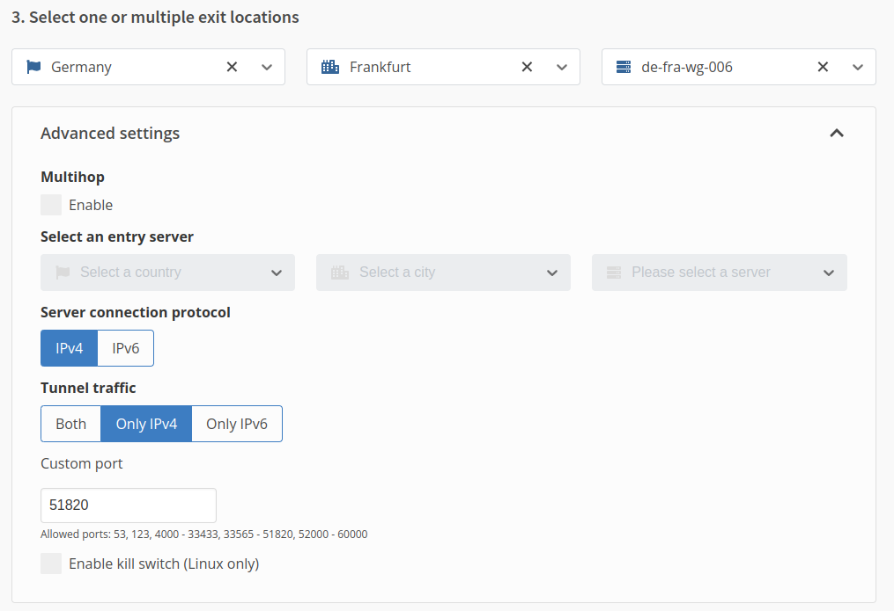
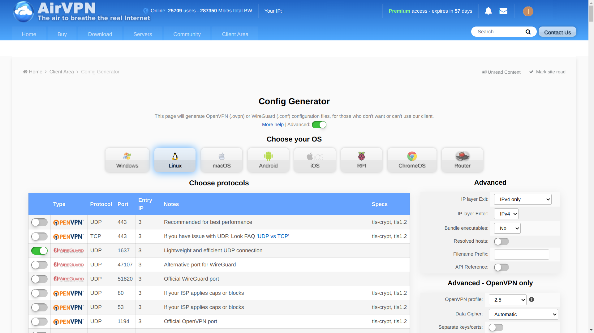
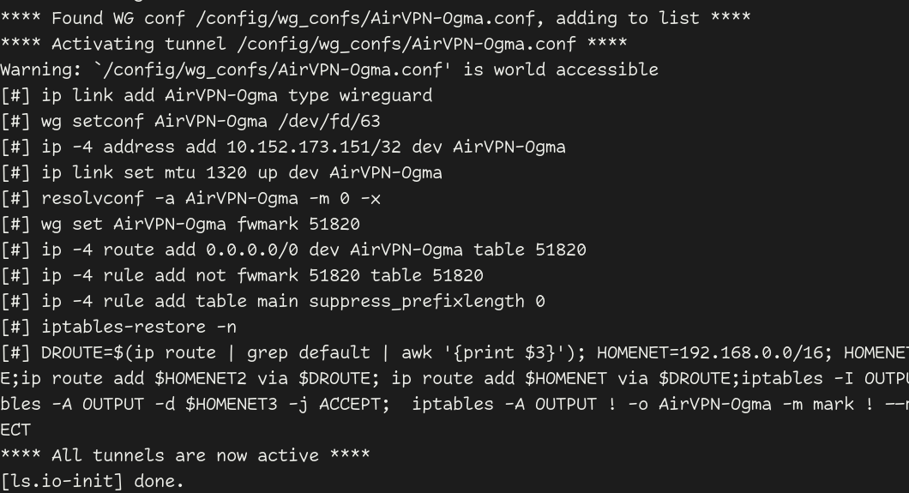

A thorough guide of my torrenting setup.
You will find everything here to set this up for yourself.
It includes step by step instructions, as well as the complete scripts I
use.
{.dropcap}

It's not specific to my VPN provider[^airvpn] or server OS, though I will use them as
examples.

[^airvpn]: [AirVPN](https://airvpn.org/?referred_by=684738) has a proven track record of not handing over user data
(they can't hand over something they don't have.)
They are one of the few providers of that caliber, which still supports port
forwarding.
You can pay in crypto and test it for three days (2€).

## WireGuard

### Obtain the config

Go to the website of your VPN provider website and generate a WireGuard
configuration file.

<details>
<summary>For Mullvad</summary>

Go into the [WireGuard configuration section](https://mullvad.net/en/account/wireguard-config)
inside your account and select these options:


</details>
<br>
<details>
<summary>For AirVPN</summary>

Go to the AirVPN client area and into the [config generator](https://airvpn.org/generator/?referred_by=684738),
select these options:



</details>

Save the result to the file `wg0.conf`.
It will look a little like this[^extra-props]:
[^extra-props]: Don't mind any extra properties in the config like `PersistentKeepalive`, `MTU` or `PresharedKey`.

```txt
[Interface]
PrivateKey = uOHkXPjTDL9W0KCOh/DjZRlaa+AORPin/A7e40Fc8G8=
Address = 10.66.170.182/32
DNS = 10.64.0.1

[Peer]
PublicKey = nAF0wrLG2+avwQfqxnXhBGPUBCvc3QCqWKH4nK5PfEU=
AllowedIPs = 0.0.0.0/0
Endpoint = 185.209.196.76:51820
```

To be able to access the Transmissions Web UI, we need to add these lines in
the `[Interface]` section:

```txt
PostUp = DROUTE=$(ip route | grep default | awk '{print $3}'); HOMENET=192.168.0.0/16; HOMENET2=10.0.0.0/8; HOMENET3=172.16.0.0/12; ip route add $HOMENET3 via $DROUTE;ip route add $HOMENET2 via $DROUTE; ip route add $HOMENET via $DROUTE;iptables -I OUTPUT -d $HOMENET -j ACCEPT;iptables -A OUTPUT -d $HOMENET2 -j ACCEPT; iptables -A OUTPUT -d $HOMENET3 -j ACCEPT;  iptables -A OUTPUT ! -o %i -m mark ! --mark $(wg show %i fwmark) -m addrtype ! --dst-type LOCAL -j REJECT
PreDown = HOMENET=192.168.0.0/16; HOMENET2=10.0.0.0/8; HOMENET3=172.16.0.0/12; ip route del $HOMENET3 via $DROUTE;ip route del $HOMENET2 via $DROUTE; ip route del $HOMENET via $DROUTE; iptables -D OUTPUT ! -o %i -m mark ! --mark $(wg show %i fwmark) -m addrtype ! --dst-type LOCAL -j REJECT; iptables -D OUTPUT -d $HOMENET -j ACCEPT; iptables -D OUTPUT -d $HOMENET2 -j ACCEPT; iptables -D OUTPUT -d $HOMENET3 -j ACCEPT
```

The result will look like this:

```txt
[Interface]
PrivateKey = uOHkXPjTDL9W0KCOh/DjZRlaa+AORPin/A7e40Fc8G8=
Address = 10.66.170.182/32
DNS = 10.64.0.1
PostUp = DROUTE=$(ip route | grep default | awk '{print $3}'); HOMENET=192.168.0.0/16; HOMENET2=10.0.0.0/8; HOMENET3=172.16.0.0/12; ip route add $HOMENET3 via $DROUTE;ip route add $HOMENET2 via $DROUTE; ip route add $HOMENET via $DROUTE;iptables -I OUTPUT -d $HOMENET -j ACCEPT;iptables -A OUTPUT -d $HOMENET2 -j ACCEPT; iptables -A OUTPUT -d $HOMENET3 -j ACCEPT;  iptables -A OUTPUT ! -o %i -m mark ! --mark $(wg show %i fwmark) -m addrtype ! --dst-type LOCAL -j REJECT
PreDown = HOMENET=192.168.0.0/16; HOMENET2=10.0.0.0/8; HOMENET3=172.16.0.0/12; ip route del $HOMENET3 via $DROUTE;ip route del $HOMENET2 via $DROUTE; ip route del $HOMENET via $DROUTE; iptables -D OUTPUT ! -o %i -m mark ! --mark $(wg show %i fwmark) -m addrtype ! --dst-type LOCAL -j REJECT; iptables -D OUTPUT -d $HOMENET -j ACCEPT; iptables -D OUTPUT -d $HOMENET2 -j ACCEPT; iptables -D OUTPUT -d $HOMENET3 -j ACCEPT

[Peer]
PublicKey = nAF0wrLG2+avwQfqxnXhBGPUBCvc3QCqWKH4nK5PfEU=
AllowedIPs = 0.0.0.0/0
Endpoint = 185.209.196.76:51820
```

The `PostUp` and `PreDown` hooks are also the reason why this setup doesn't
work with IPv6.

### Start the container

Before we start the container, we need to think about where to put the
configuration.
In most OS's you can put them in `/opt/docker/volumes/wireguard/config`, but
on [Unraid](https://unraid.net) that directory will not survive a reboot,
which is why I put it in `/mnt/cache/appdata/wireguard`.
Create a directory called `wg_confs` inside of the directory you decided on
an put your wireguard configuration file (`wg0.conf`) in it.

Then start the [container](https://hub.docker.com/r/linuxserver/wireguard) (replace the volume accordingly):

```sh
docker run -d --name="wireguard" \
    --volume /mnt/cache/appdata/wireguard:/config \
    --volume /lib/modules:/lib/modules \
    --publish 51820:51820/udp \
    --publish 9091:9091 \
    --env PUID=1022 \
    --env PGID=1022 \
    --env VIRTUAL_PORT=9091 \
    --cap-add=NET_ADMIN \
    --cap-add=SYS_MODULE \
    --sysctl="net.ipv4.conf.all.src_valid_mark=1" \
    --restart=unless-stopped \
    linuxserver/wireguard
```

If it tells you that the named container already exists, you can remove it
like this:

```sh
docker stop wireguard 2>/dev/null
docker rm wireguard 2>/dev/null
```

#### Debugging

Look the logs:

```sh
docker logs wireguard
```

Success would look something like this:



The error: `Error: IPv6 is disabled on nexthop device.`, is why I disabled
IPv6 when selecting the wireguard configuration.
This can also be achieved by removing any IPv6 addresses in the `Address`
and `AllowedIPs` fields of the configuration after downloading it.

### Test connectivity

We want to make sure the your wireguard container masks any of your requests
by routing them through the configured VPN connection.
We can test this with the service [ipinfo](https://ipinfo.io).
They will tell you what public IP made the request.
Make a request against them from inside the container:

```sh
# through the container
docker exec wireguard sh -c 'curl -Ss https://ipinfo.io'

# if it says 'Could not resolve host', try restarting the container:
docker restart wireguard

# without the container (should be your home address, for comparison)
curl -Ss https://ipinfo.io
```

The output will look like this:
```json
{
  "ip": "185.209.196.210",
  "city": "Frankfurt am Main",
  "region": "Hesse",
  "country": "DE",
  "loc": "50.1155,8.6842",
  "org": "AS39351 31173 Services AB",
  "postal": "60306",
  "timezone": "Europe/Berlin",
  "readme": "https://ipinfo.io/missingauth"
}
```
Notice that the given IP is the one specified in your wireguard config as the
`Endpoint` and the city is the one you configured.

### Enable port forwarding

If your VPN provider supports port forwarding, activate it on a port of your
choosing:

<details>
<summary>Activate port forwarding on AirVPN</summary>

In the client area under [Ports](https://airvpn.org/ports/?referred_by=684738) you can add a
new port:

</details>

These lines in your wireguard startup script will let your containers use
the ports configured with your VPN provider:

```txt
--publish 29142:29142/udp \
--publish 29142:29142 \
```

## Transmission

### Start the container

With the config directory the same considerations as with wireguard apply.
Additionally you need to specify a directory for completed and
incompleted download files.
I store them on my Unraid media share, in `/mnt/user/media/torrents`.

Then start the [container](https://hub.docker.com/r/linuxserver/transmission):

```sh
docker run -d --name="transmission" \
    --volume /mnt/cache/appdata/transmission:/config \
    --volume /mnt/user/media/torrents:/downloads \
    --network=container:wireguard \
    --env UID=1008 \
    --env GID=1008 \
    --env TZ="Europe/Berlin" \
    --restart=unless-stopped \
    linuxserver/transmission
```

The line `--network=container:wireguard` is the crux of this whole setup.
We're using the the network created by the running wireguard container.
Any requests to the internet are made throught the wireguard container and
thus your VPN connection.

You can test this by making a request through the container.
You will observe that the same IP is being used as for requests made through
the wireguard container:
```sh
docker exec transmission sh -c 'curl -Ss https://ipinfo.io'
```
To enable port forwarding in transmission add `--env PEERPORT=29142` to its
startup script.

### Install web UI

The transmission web UI does not come bundled with the app anymore.
We need to install it into our config directory.
There are multiple options available.
I just went with transmission-web-control.

Head over to their [Github releases](https://github.com/transmission-web-control/transmission-web-control/releases)
and copy the link to their latest release as `dist.zip`.
Go into your transmission config directory and:

```sh
mkdir web
cd web
wget https://github.com/transmission-web-control/transmission-web-control/releases/download/v1.6.31/dist.zip
unzip dist.zip
mv dist transmission-web-control
rm dist.zip
```

In your startup script you can now supply the web UI to use like this:
```txt
--env TRANSMISSION_WEB_HOME=/config/web/transmission-web-control \
--env USER=transmission \
--env PASS=1234 \
```

The transmission web UI will now be available on the port `9091`.
Login using the credentials specified under `USER` and `PASS`.

You can now test transmissions ability to download.
For example with the [archlinux iso](https://archlinux.org/download).

To make the web UI accessible through the wireguard container you can add
`--publish 9091:9091` to its script.
You might also want or need to add a specific IP address to wireguard with
e.g. `--ip='192.168.178.7'`.

### Install flood

I primarily use the flood as my transmission interface.
It comes in its own [container](https://hub.docker.com/r/jesec/flood):

```sh
docker run -d --name=tflood \
    -p 3000:3000 \
    jesec/flood
```

Flood is now available on the port `3000`.
Transmission connection and credentials can be configured on startup.

## Putting it all together

On my server I have a scripts to (re)start each container and a script that
(re)starts them in order.

These scripts include a lot of quirky little steps that might not be
necessary, but were added over time to make it run more smoothly.

`wireguard`:
```sh
#! /bin/sh

docker stop wireguard 2>/dev/null
docker rm wireguard 2>/dev/null
docker run -d --name="wireguard" \
    --volume /mnt/cache/appdata/wireguard:/config \
    --volume /lib/modules:/lib/modules \
    --publish 51820:51820/udp \
    --publish 29142:29142/udp \
    --publish 29142:29142 \
    --publish 9091:9091 \
    --net='br0' --ip='192.168.178.7' \
    --env PUID=1022 \
    --env PGID=1022 \
    --env VIRTUAL_HOST=torrent \
    --env VIRTUAL_PORT=9091 \
    --cap-add=NET_ADMIN \
    --cap-add=SYS_MODULE \
    --sysctl="net.ipv4.conf.all.src_valid_mark=1" \
    --label net.unraid.docker.icon="https://raw.githubusercontent.com/NightMeer/Unraid-Docker-Templates/main/images/wireguard.png" \
    --restart=unless-stopped \
    --pull=always \
    linuxserver/wireguard

sleep 5
docker restart wireguard
sleep 5
docker exec wireguard sh -c 'curl -Ss https://ipinfo.io'
```

`transmission`:
```sh
#! /bin/sh

docker stop transmission 2>/dev/null
docker rm transmission 2>/dev/null
docker run -d --name="transmission" \
    --volume /mnt/cache/appdata/transmission:/config \
    --volume /mnt/user/media/torrents:/downloads \
    --volume /mnt/user/media/movies/torrents:/movie \
    --volume /mnt/user/media/documentaries/torrents:/docu \
    --volume /mnt/user/media/series:/series \
    --volume /mnt/user/media/docuseries:/docuseries \
    --volume /mnt/user/media/standup:/standup \
    --volume /mnt/user/media/requests:/req \
    --volume /mnt/user/media/requests-series:/reqs \
    --volume "/mnt/user/media/audiobooks/non-fiction audio":/nonfic \
    --volume "/mnt/user/media/audiobooks/fiction audio":/fic \
    --volume /mnt/user/media/books/books:/books \
    --volume /mnt/user/syncthing/media/_inbox:/dl \
    --network=container:wireguard \
    --env UID=1008 \
    --env GID=1008 \
    --env USER=transmission \
    --env PASS=M5N3n3OJ4NWXImzzsfPfMYNoUVShkuzEcZez5gHBicqehiSKPa \
    --env TRANSMISSION_WEB_HOME=/config/web/transmission-web-control \
    --env PEERPORT=29142 \
    --env TZ="Europe/Berlin" \
    --label net.unraid.docker.icon="https://raw.githubusercontent.com/linuxserver/docker-templates/master/linuxserver.io/img/transmission-logo.png" \
    --restart=unless-stopped \
    linuxserver/transmission

sleep 5
# double check for the paranoia :)
docker exec transmission sh -c 'curl -Ss https://ipinfo.io'
```

`flood`
```sh
#! /bin/sh

docker stop tflood 2>/dev/null
docker rm tflood 2>/dev/null
docker run -d --name=tflood \
        -p 3000:3000 \
        -e HOME=/config \
        --volume /mnt/user/appdata/flood:/config \
        --net='br0' --ip='192.168.178.10' \
        --label net.unraid.docker.icon="https://hotio.dev/webhook-avatars/flood.png" \
        jesec/flood
```

Now all together.
`start`:
```sh
#!/bin/sh

./wireguard
./transmission && ./mam-ip
./flood
```

`mam-ip` is a script of mine, that lets a private tracker know of my new IP
address.

## Conclusions

That's it folks.
This should give you all you need to reproduce my setup for yourself.
Enjoy:slightly_smiling_face:

## References

Originally this setup was based on [this reddit post](https://www.reddit.com/r/VPNTorrents/comments/j1ap68/my_docker_setup_for_torrenting_transmission/).
Many adjustments were made.

**Other torrent daemons**

You can easily replace transmission with any other containerized torrent
daemon.
The wireguard container allows for it and you should have everything here
that you need.

**Other ways of testing connectivity:**

In the comments of [reddit post](https://www.reddit.com/r/VPNTorrents/comments/j1ap68/my_docker_setup_for_torrenting_transmission/)
there are also other ways of testing connectivity described.
Though, I'm just fine with ipinfo.
