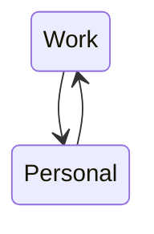
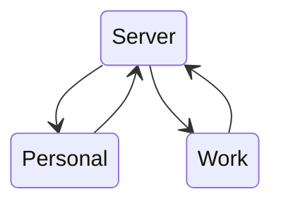
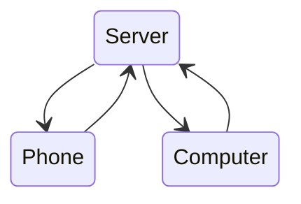

If you're not using a note-taking app that handles synchronization for you,
you'll have to find a different solution.

This guide is going to detail how I use [Syncthing](https://syncthing.net) for
all my synchronization needs and how I use [Signal](https://signal.org) as my
notes inbox.

## Syncthing
### Why Syncthing

- it just works™
- open source
- feels-like-instant sync
- works behind NAT router
- nice management web-UI
- decent memory/cpu usage
    + Has configurable run conditions on the phone to e.g. only run while being charged
- you don't have to pay for storage with a cloud provider
    + Dropbox's free plan is a paltry 2GB
    + my notes are 30GB and I don't have to care
- ignore patterns
    + very useful for node_modules, vendor, etc.
- nested folders (more on that later)
- built-in versioning
    + so you can easily revert unintentional changes/deletions

### Between computers

My most basic use case was syncing my notes between my work and personal
computer. My [setup](https://github.com/jneidel/dotfiles) is running on both
machines, with some tweaks depending specific on the device, all I need is to
plug in my notes.

You can sync directly between the machines:




But I would recommend you put a server in between, so you can also sync without
them both being online at the same time (e.g. you close the one machine and open the other.)




### Between phone and computer

I'm using [Syncthing-Fork](https://f-droid.org/en/packages/com.github.catfriend1.syncthingandroid/) on my phone.
The dynamic is much the same:



I have a media sync with my music library, podcasts, movies, etc. To only sync
parts of this I can use nested folders and only expose a subset to my phone:

```txt
.
└── media             <-- syncthing folder 1
    ├── movies
    ├── music
    │   └── symlink to ../phone/music
    └── phone         <-- syncthing folder 2
        ├── podcasts
        └── music

```

Like this I can add new music and podcasts from my computer and delete stuff I heard
podcasts from my phone.
Much easier than the manual ftp moving I did before.

With the symlink I have the phones music integrated into my mpd setup, which
will automatically have deletion from the phone of song I don't like synced.

### The server

Ran fine on a Raspberry Pi.
I only had a problem with the external drive I attached. It always went to sleep
and refused to be woken up by Syncthing.
I just wrote a script that constantly pinged it.
Not ideal, but works.

Now I have it running on my homeserver with NAS drives and regular (off-site)
backups.

## Signal as an inbox

I only use my phone to jot down notes, not to read them.

My unoptimized workflow was me writing into a Signal chat with myself and copying out the notes on my computer.
The obvious improvement was to automate that by having a script read out the signal chat
and create notes out of the messages.

Basically, you set up a new number in [signal-cli](https://github.com/AsamK/signal-cli)
and have it's output parsed by a script.
It might be simpler to use this [REST API](https://github.com/bbernhard/signal-cli-rest-api) wrapper
instead of wildly grepping the not-so-parse-friendly default message format like
I did.

Here's the script for reference ([lastest version is here](https://github.com/jneidel/dotfiles/blob/master/scripts/cron/signal-to-inbox), it's not pretty but it works reliably):

```sh
#! /bin/sh

. $HOME/scripts/personal/signal_number.sh

INBOX=$HOME/org/0_inbox
XDG_DATA_HOME=${XDG_DATA_HOME:-$HOME/.local/share}
CACHE_DIR=$XDG_DATA_HOME/signal-cli
ERROR_LOG=$CACHE_DIR/error.log
ATTACHMENT_DIR="$CACHE_DIR/attachments"
NUMBERS_WHITELIST=$HOME/scripts/personal/signal-numbers-whitelist

if [ "$1" = "--help" ] || [ "$1" = "-h" ] || [ "$1" = "help" ]; then
  cat <<EOF
$ signal-to-inbox
Receive signal messages and sort them into the inbox

Prerequisite is to register the number with signal
EOF
  exit
fi

command -v signal-cli >/dev/null || { echo "signal-cli is not installed" 1>&2; exit 127; }

CACHE_FILE="$CACHE_DIR/received-messages-$(date +%s)"

is_whitelisted() {
  local number="$1"
  if grep "$number" $NUMBERS_WHITELIST >/dev/null; then
    true
  else
    false
  fi
}

receive() {
  signal-cli -a $SIGNAL_NUMBER receive --ignore-stories --send-read-receipts >$CACHE_FILE 2>/tmp/signal-cli-errors ||
    echo "Receiving signal messages failed!\nRun the script manually or consult /tmp/signal-cli-errors" >$INBOX/signal-cli-errors
}
parseMessages() {
  if [ -z "$(cat $CACHE_FILE)" ]; then
    rm $CACHE_FILE
  else
    N=0
    BODY=""
    ATTACHMENT=""
    ignore_message=0
    attachment_count=1
    is_multiline=0
    multiline_body_done=0
    while read line; do
      if [ -n "$BODY" ] && [ "$multiline_body_done" -eq 0 ]; then
        if echo $line | grep -ve "^Expires in:" >/dev/null; then
          BODY="${BODY}\n$line"
          is_multiline=1
        else
          multiline_body_done=1
        fi
      fi

      has_envelope=`echo $line | grep -Po "^Envelope from: .+?\K\+\d+"`
      if [ -n "$has_envelope" ] && ! is_whitelisted "$has_envelope"; then
        ignore_message=1
      fi

      has_body=`echo $line | grep -Po "^Body: \K.+"`
      if [ -n "$has_body" ]; then
        BODY="$has_body"
      fi

      has_filename=`echo $line | grep -Po "Filename: \K.+"`
      if [ -n "$ATTACHMENT" ] && [ -n "$has_filename" ] && [ "$ignore_message" -eq 0 ]; then
          cp "$ATTACHMENT_DIR/$ATTACHMENT" "$INBOX/$has_filename"
          ATTACHMENT=""
          attachment_count=$((${attachment_count}+1))
      fi

      has_attachement=`echo $line | grep -Po "Id: \K.+"`
      if [ -n "$has_attachement" ] && [ "$ignore_message" -eq 0 ]; then
        if [ -n "$ATTACHMENT" ]; then
          if [ -n "$BODY" ]; then
            cp "$ATTACHMENT_DIR/$ATTACHMENT" "$INBOX/$BODY-$attachment_count.${ATTACHMENT##*.}" 2>$ERROR_LOG
          else
            cp "$ATTACHMENT_DIR/$ATTACHMENT" $INBOX/ 2>$ERROR_LOG
          fi
          ATTACHMENT=""
        fi
        ATTACHMENT="$has_attachement"
      fi

      if [ -z "$line" ] && ([ "$is_multiline" -eq 0 ] || [ "$multiline_body_done" -eq 1 ]); then # reset
        if [ -n "$BODY" ] && [ -z "$ATTACHMENT" ] && [ "$ignore_message" -eq 0 ]; then
          body_shortend=`echo $BODY | tr "\n" " " | cut -c-50`
          filename=$body_shortend
          if echo $body_shortend | grep ":" >/dev/null; then
            filename=`echo $body_shortend | cut -d: -f1`
          fi

          echo "$BODY" >"$INBOX/$filename.norg"
        fi

        if [ -n "$ATTACHMENT" ] && [ "$ignore_message" -eq 0 ]; then
          if [ -n "$BODY" ]; then
            cp "$ATTACHMENT_DIR/$ATTACHMENT" "$INBOX/$BODY-$attachment_count.${ATTACHMENT##*.}" 2>$ERROR_LOG
          else
            cp "$ATTACHMENT_DIR/$ATTACHMENT" $INBOX/ 2>$ERROR_LOG
          fi
        fi

        N=$((${N}+1))
        BODY=""
        ATTACHMENT=""
        attachment_count=1
        multiline_body_done=0
        is_multiline=0
        ignore_message=0
      fi
    done <$CACHE_FILE
  fi
}

receive
parseMessages
```

Now I can easily put a note into my note-taking system directly from Signal.
I also routinely forward messages from other chats, emails, photos, PDFs and
whatever else I might run across on my phone.
